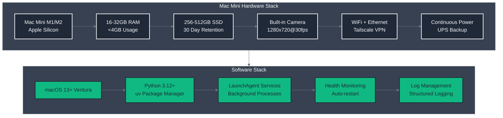
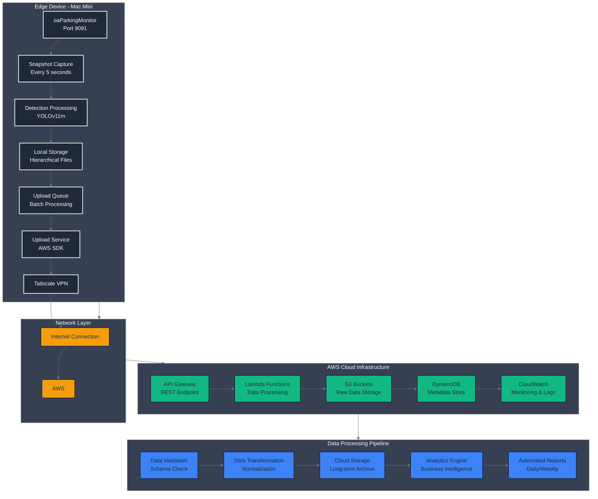
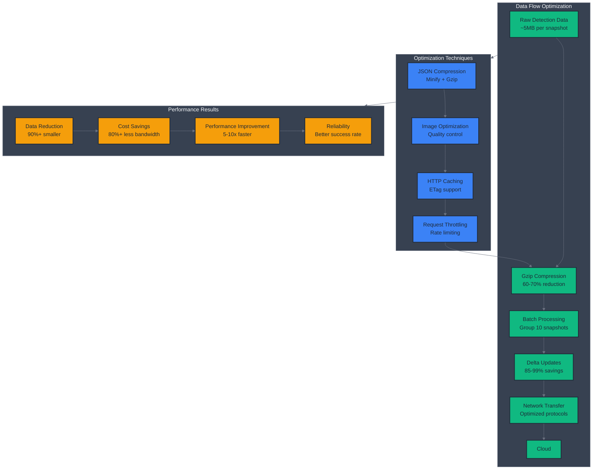

# oaParkingMonitor Integration Guide

## Overview

oaParkingMonitor is an edge-deployed parking space detection and monitoring service optimized for Mac Mini M1/M2 devices with YOLOv11m models and comprehensive AWS cloud integration. This guide covers edge deployment architecture, cloud synchronization, and network optimization patterns.

## Edge Deployment Architecture

### Hardware Requirements



### Service Deployment

#### LaunchAgent Configuration

```xml
<!-- ~/Library/LaunchAgents/com.orangead.parking-monitor.plist -->
<?xml version="1.0" encoding="UTF-8"?>
<!DOCTYPE plist PUBLIC "-//Apple//DTD PLIST 1.0//EN" "http://www.apple.com/DTDs/PropertyList-1.0.dtd">
<plist version="1.0">
<dict>
    <key>Label</key>
    <string>com.orangead.parking-monitor</string>
    <key>ProgramArguments</key>
    <array>
        <string>/Users/admin/orangead/oaParkingMonitor/.venv/bin/python</string>
        <string>-m</string>
        <string>src.main</string>
    </array>
    <key>WorkingDirectory</key>
    <string>/Users/admin/orangead/oaParkingMonitor</string>
    <key>RunAtLoad</key>
    <true/>
    <key>KeepAlive</key>
    <true/>
    <key>StandardOutPath</key>
    <string>/tmp/oaParkingMonitor.out</string>
    <key>StandardErrorPath</key>
    <string>/tmp/oaParkingMonitor.err</string>
    <key>EnvironmentVariables</key>
    <dict>
        <key>PYTHONPATH</key>
        <string>/Users/admin/orangead/oaParkingMonitor/src</string>
        <key>LOG_LEVEL</key>
        <string>INFO</string>
    </dict>
</dict>
</plist>
```

#### Deployment via oaAnsible

```yaml
# oaAnsible playbook for parking monitor deployment
- name: Deploy oaParkingMonitor to Mac Mini
  hosts: mac_minis
  vars:
    parking_monitor_version: "v1.2.0"
    parking_monitor_port: 9091
    parking_monitor_camera_source: "0"  # Built-in camera

  tasks:
    - name: Create parking monitor directory
      file:
        path: ~/orangead/oaParkingMonitor
        state: directory
        mode: '0755'

    - name: Sync parking monitor code
      synchronize:
        src: ../../oaParkingMonitor/
        dest: ~/orangead/oaParkingMonitor/
        delete: yes

    - name: Install Python dependencies
      shell: cd ~/orangead/oaParkingMonitor && uv sync

    - name: Configure parking zones
      template:
        src: config/mvp.yaml.j2
        dest: ~/orangead/oaParkingMonitor/config/mvp.yaml

    - name: Install LaunchAgent
      copy:
        src: files/com.orangead.parking-monitor.plist
        dest: ~/Library/LaunchAgents/com.orangead.parking-monitor.plist

    - name: Load and start service
      shell: |
        launchctl unload ~/Library/LaunchAgents/com.orangead.parking-monitor.plist 2>/dev/null || true
        launchctl load ~/Library/LaunchAgents/com.orangead.parking-monitor.plist
        launchctl start com.orangead.parking-monitor

    - name: Verify service health
      uri:
        url: "http://localhost:9091/health"
        method: GET
      register: health_check
      until: health_check.status == 200
      retries: 10
      delay: 5
```

## Cloud Integration Architecture

### AWS Infrastructure Setup

#### CloudFormation Template

```yaml
# AWS CloudFormation for parking monitor infrastructure
AWSTemplateFormatVersion: '2010-09-09'
Description: 'oaParkingMonitor AWS Infrastructure'

Parameters:
  Environment:
    Type: String
    Default: 'production'
    AllowedValues: ['development', 'staging', 'production']

Resources:
  # S3 Buckets
  ParkingDataBucket:
    Type: AWS::S3::Bucket
    Properties:
      BucketName: !Sub 'parking-monitor-data-${Environment}'
      VersioningConfiguration:
        Status: Enabled
      LifecycleConfiguration:
        Rules:
          - Id: DeleteOldSnapshots
            Status: Enabled
            ExpirationInDays: 365
            Transitions:
              - TransitionInDays: 30
                StorageClass: STANDARD_IA
              - TransitionInDays: 90
                StorageClass: GLACIER

  ParkingMetadataBucket:
    Type: AWS::S3::Bucket
    Properties:
      BucketName: !Sub 'parking-monitor-metadata-${Environment}'
      VersioningConfiguration:
        Status: Enabled

  # API Gateway
  ParkingMonitorAPI:
    Type: AWS::ApiGateway::RestApi
    Properties:
      Name: !Sub 'parking-monitor-api-${Environment}'
      Description: 'API for parking monitor data ingestion'

  # Lambda Functions
  DataProcessorFunction:
    Type: AWS::Lambda::Function
    Properties:
      FunctionName: !Sub 'parking-data-processor-${Environment}'
      Runtime: python3.11
      Handler: lambda_function.lambda_handler
      Code:
        ZipFile: |
          import json
          import boto3

          def lambda_handler(event, context):
              # Process parking data from edge device
              s3 = boto3.client('s3')
              # Add processing logic here
              return {'statusCode': 200, 'body': json.dumps('Success')}
      Environment:
        Variables:
          DATA_BUCKET: !Ref ParkingDataBucket
          METADATA_BUCKET: !Ref ParkingMetadataBucket

  # DynamoDB Tables
  ParkingMetadataTable:
    Type: AWS::DynamoDB::Table
    Properties:
      TableName: !Sub 'parking-metadata-${Environment}'
      BillingMode: PAY_PER_REQUEST
      AttributeDefinitions:
        - AttributeName: 'device_id'
          AttributeType: 'S'
        - AttributeName: 'timestamp'
          AttributeType: 'N'
      KeySchema:
        - AttributeName: 'device_id'
          KeyType: 'HASH'
        - AttributeName: 'timestamp'
          KeyType: 'RANGE'

  # CloudWatch Alarms
  HighErrorRateAlarm:
    Type: AWS::CloudWatch::Alarm
    Properties:
      AlarmName: !Sub 'parking-monitor-high-error-rate-${Environment}'
      MetricName: 'Errors'
      Namespace: 'ParkingMonitor'
      Statistic: 'Sum'
      Period: 300
      EvaluationPeriods: 2
      Threshold: 10
      AlarmActions:
        - !Ref SNSTopicArn

Outputs:
  DataBucketName:
    Description: 'S3 bucket for parking data'
    Value: !Ref ParkingDataBucket
    Export:
      Name: !Sub '${AWS::StackName}-DataBucket'

  APIEndpoint:
    Description: 'API Gateway endpoint'
    Value: !Sub 'https://${ParkingMonitorAPI}.execute-api.${AWS::Region}.amazonaws.com/prod'
    Export:
      Name: !Sub '${AWS::StackName}-APIEndpoint'
```

### Edge-to-Cloud Data Flow



### AWS Upload Service Implementation

#### Boto3 Configuration

```python
# src/services/aws_upload_service.py
import boto3
import json
import gzip
from datetime import datetime, timezone
from pathlib import Path
from typing import Dict, List, Optional
import logging

class AWSUploadService:
    def __init__(self, config: Dict):
        self.config = config
        self.logger = logging.getLogger(__name__)

        # Initialize AWS clients
        self.s3_client = boto3.client(
            's3',
            region_name=config['aws_region'],
            aws_access_key_id=config['aws_access_key'],
            aws_secret_access_key=config['aws_secret_key']
        )

        self.apigateway_client = boto3.client(
            'apigateway',
            region_name=config['aws_region']
        )

        self.data_bucket = config['s3_data_bucket']
        self.metadata_bucket = config['s3_metadata_bucket']
        self.api_endpoint = config['api_gateway_endpoint']

        # Upload queue and retry logic
        self.upload_queue: List[Dict] = []
        self.max_batch_size = config.get('max_batch_size', 10)
        self.upload_interval = config.get('upload_interval', 60)

    def queue_for_upload(self, detection_data: Dict, image_path: Path):
        """Queue detection data and image for upload"""
        upload_item = {
            'detection_data': detection_data,
            'image_path': image_path,
            'timestamp': datetime.now(timezone.utc).isoformat(),
            'retry_count': 0,
            'max_retries': 3
        }

        self.upload_queue.append(upload_item)
        self.logger.info(f"Queued for upload: {image_path.name}")

    async def process_upload_queue(self):
        """Process upload queue in batches"""
        if not self.upload_queue:
            return

        # Process in batches
        batch = self.upload_queue[:self.max_batch_size]
        self.upload_queue = self.upload_queue[self.max_batch_size:]

        try:
            await self._upload_batch(batch)
            self.logger.info(f"Successfully uploaded batch of {len(batch)} items")
        except Exception as e:
            self.logger.error(f"Failed to upload batch: {e}")
            # Re-queue failed items with retry increment
            for item in batch:
                item['retry_count'] += 1
                if item['retry_count'] < item['max_retries']:
                    self.upload_queue.append(item)

    async def _upload_batch(self, batch: List[Dict]):
        """Upload a batch of items to AWS"""
        upload_tasks = []

        for item in batch:
            task = self._upload_single_item(item)
            upload_tasks.append(task)

        # Wait for all uploads to complete
        results = await asyncio.gather(*upload_tasks, return_exceptions=True)

        # Handle results
        for i, result in enumerate(results):
            if isinstance(result, Exception):
                self.logger.error(f"Upload failed for item {i}: {result}")
                raise result

    async def _upload_single_item(self, item: Dict):
        """Upload a single detection item"""
        detection_data = item['detection_data']
        image_path = item['image_path']
        timestamp = item['timestamp']

        # Generate S3 keys
        date_prefix = datetime.fromisoformat(timestamp.replace('Z', '+00:00')).strftime('%Y/%m/%d')
        image_key = f"snapshots/{date_prefix}/{image_path.name}"
        metadata_key = f"metadata/{date_prefix}/{image_path.stem}.json"

        # Upload image to S3
        if image_path.exists():
            with open(image_path, 'rb') as f:
                self.s3_client.put_object(
                    Bucket=self.data_bucket,
                    Key=image_key,
                    Body=f,
                    ContentType='image/jpeg',
                    Metadata={
                        'timestamp': timestamp,
                        'device_id': detection_data.get('device_id', 'unknown')
                    }
                )

        # Upload metadata to S3
        metadata_json = json.dumps(detection_data, default=str)
        self.s3_client.put_object(
            Bucket=self.metadata_bucket,
            Key=metadata_key,
            Body=metadata_json,
            ContentType='application/json'
        )

        # Send to API Gateway for processing
        await self._send_to_api(detection_data, timestamp)

    async def _send_to_api(self, detection_data: Dict, timestamp: str):
        """Send detection data to API Gateway"""
        import httpx

        payload = {
            'timestamp': timestamp,
            'device_id': detection_data.get('device_id'),
            'detection_results': detection_data,
            'upload_timestamp': datetime.now(timezone.utc).isoformat()
        }

        async with httpx.AsyncClient(timeout=30.0) as client:
            response = await client.post(
                f"{self.api_endpoint}/detections",
                json=payload,
                headers={
                    'Content-Type': 'application/json',
                    'X-API-Key': self.config.get('api_key', '')
                }
            )

            if response.status_code != 200:
                raise Exception(f"API upload failed: {response.status_code} - {response.text}")

    def get_upload_status(self) -> Dict:
        """Get upload service status and statistics"""
        return {
            'queue_size': len(self.upload_queue),
            'last_upload': getattr(self, 'last_upload_timestamp', None),
            'total_uploads': getattr(self, 'total_uploads', 0),
            'failed_uploads': getattr(self, 'failed_uploads', 0),
            'aws_connected': self._test_aws_connection()
        }

    def _test_aws_connection(self) -> bool:
        """Test AWS connectivity"""
        try:
            self.s3_client.head_bucket(Bucket=self.data_bucket)
            return True
        except Exception:
            return False
```

## Configuration Management

### Environment Configuration

```yaml
# .env file for AWS and service configuration
# AWS Configuration
AWS_ACCESS_KEY_ID=your_access_key_here
AWS_SECRET_ACCESS_KEY=your_secret_key_here
AWS_REGION=us-west-2
S3_DATA_BUCKET=parking-monitor-data-production
S3_METADATA_BUCKET=parking-monitor-metadata-production
API_GATEWAY_ENDPOINT=https://api.example.com/prod

# Service Configuration
PARKING_MONITOR_PORT=9091
CAMERA_SOURCE=0
LOG_LEVEL=INFO

# Upload Configuration
MAX_BATCH_SIZE=10
UPLOAD_INTERVAL=60
MAX_RETRIES=3

# Performance Configuration
SNAPSHOT_INTERVAL=5
CONFIDENCE_THRESHOLD=0.5
MAX_CONCURRENT_UPLOADS=5
```

### Zone Configuration Management

```yaml
# config/mvp.yaml - Parking zone definitions
parking_zones:
  # Front row zones (easier detection)
  - id: 1
    space_id: 1
    name: "A1"
    description: "Front row parking space 1"
    coordinates: [[100, 200], [300, 200], [300, 400], [100, 400]]
    detection_difficulty: "easy"

  - id: 2
    space_id: 2
    name: "A2"
    description: "Front row parking space 2"
    coordinates: [[320, 200], [520, 200], [520, 400], [320, 400]]
    detection_difficulty: "easy"

  # Back row zones (harder detection)
  - id: 8
    space_id: 8
    name: "B1"
    description: "Back row parking space 1"
    coordinates: [[100, 450], [300, 450], [300, 650], [100, 650]]
    detection_difficulty: "hard"

# Camera configuration
camera:
  width: 1280
  height: 720
  fps: 30
  source: "0"

# Detection configuration
detection:
  model: "models/yolov11m.pt"
  confidence: 0.5
  classes: [2, 3, 5, 7]  # car, motorcycle, bus, truck

# Processing configuration
processing:
  snapshot_interval: 5  # seconds
  temporal_smoothing: true
  smoothing_window: 3

# API configuration
api:
  host: "0.0.0.0"
  port: 9091
  enable_cors: true

# Upload configuration
upload:
  enabled: true
  batch_size: 10
  interval: 60  # seconds
  compression: true
```

### Dynamic Configuration Updates

```python
# src/config/manager.py - Configuration management
from typing import Dict, Any, Optional
import yaml
from pathlib import Path
import logging
from ..models.shared import ParkingConfig

class ConfigManager:
    def __init__(self, config_path: Path):
        self.config_path = config_path
        self.logger = logging.getLogger(__name__)
        self._config: Optional[ParkingConfig] = None
        self._last_modified = 0

    def load_config(self) -> ParkingConfig:
        """Load configuration with automatic reloading"""
        try:
            current_modified = self.config_path.stat().st_mtime

            if self._config is None or current_modified > self._last_modified:
                self.logger.info("Loading configuration from disk")

                with open(self.config_path, 'r') as f:
                    config_data = yaml.safe_load(f)

                self._config = ParkingConfig(**config_data)
                self._last_modified = current_modified

                self.logger.info(f"Configuration loaded: {len(self._config.parking_zones)} zones")

        except Exception as e:
            self.logger.error(f"Failed to load configuration: {e}")
            if self._config is None:
                # Create default configuration on first load failure
                self._config = ParkingConfig()

        return self._config

    def update_zones(self, zones_data: List[Dict]) -> bool:
        """Update parking zone configuration"""
        try:
            config = self.load_config()
            config.parking_zones = zones_data

            # Validate new configuration
            validated_config = ParkingConfig(**config.model_dump())

            # Save to disk
            with open(self.config_path, 'w') as f:
                yaml.dump(validated_config.model_dump(exclude_none=True), f, default_flow_style=False)

            # Clear cache to force reload
            self._config = None

            self.logger.info(f"Updated {len(zones_data)} parking zones")
            return True

        except Exception as e:
            self.logger.error(f"Failed to update zones: {e}")
            return False

    def get_zone_by_id(self, zone_id: int) -> Optional[Dict]:
        """Get zone configuration by ID"""
        config = self.load_config()
        for zone in config.parking_zones:
            if zone.id == zone_id:
                return zone.model_dump()
        return None
```

## Network Optimization Patterns

### Bandwidth Efficiency



### Implementation Patterns

#### Compression Middleware

```python
# src/middleware/compression.py
import gzip
from fastapi import Request, Response
from fastapi.middleware.base import BaseHTTPMiddleware
import logging

class CompressionMiddleware(BaseHTTPMiddleware):
    def __init__(self, app, min_size: int = 512):
        super().__init__(app)
        self.min_size = min_size
        self.logger = logging.getLogger(__name__)

    async def dispatch(self, request: Request, call_next):
        # Process request
        response = await call_next(request)

        # Only compress JSON responses
        if (response.headers.get("content-type", "").startswith("application/json") and
            len(response.body) > self.min_size):

            try:
                # Compress response body
                compressed_body = gzip.compress(response.body)

                # Create new response with compressed data
                compressed_response = Response(
                    content=compressed_body,
                    status_code=response.status_code,
                    headers=dict(response.headers),
                    media_type="application/json"
                )

                # Update headers for compression
                compressed_response.headers["content-encoding"] = "gzip"
                compressed_response.headers["content-length"] = str(len(compressed_body))

                # Log compression stats
                compression_ratio = (1 - len(compressed_body) / len(response.body)) * 100
                self.logger.debug(f"Compressed response: {compression_ratio:.1f}% reduction")

                return compressed_response

            except Exception as e:
                self.logger.error(f"Compression failed: {e}")
                # Return original response if compression fails
                return response

        return response
```

#### Delta Update Implementation

```python
# src/tracking/zone_change_tracker.py
from typing import Dict, List, Optional, Any
import time
from dataclasses import dataclass
from ..models.shared import ParkingZone

@dataclass
class ZoneChange:
    zone_id: int
    previous_state: Dict[str, Any]
    current_state: Dict[str, Any]
    timestamp: float
    change_type: str  # 'occupied', 'vacated', 'confidence_change'

class ZoneChangeTracker:
    def __init__(self, max_history: int = 600):  # 10 minutes
        self.max_history = max_history
        self.previous_zones: Dict[int, Dict[str, Any]] = {}
        self.change_history: List[ZoneChange] = []

    def update_zones(self, zones: List[ParkingZone]) -> List[ZoneChange]:
        """Update zones and return list of changes"""
        changes = []
        current_time = time.time()

        for zone in zones:
            current_state = {
                'occupied': zone.occupied,
                'confidence': zone.confidence,
                'last_detection': zone.last_detection
            }

            zone_id = zone.id
            previous_state = self.previous_zones.get(zone_id, {})

            # Check for changes
            if not previous_state:
                # First time seeing this zone
                changes.append(ZoneChange(
                    zone_id=zone_id,
                    previous_state={},
                    current_state=current_state,
                    timestamp=current_time,
                    change_type='initial'
                ))
            else:
                # Check for occupancy change
                if previous_state.get('occupied') != current_state['occupied']:
                    change_type = 'occupied' if current_state['occupied'] else 'vacated'
                    changes.append(ZoneChange(
                        zone_id=zone_id,
                        previous_state=previous_state,
                        current_state=current_state,
                        timestamp=current_time,
                        change_type=change_type
                    ))

                # Check for significant confidence change
                prev_conf = previous_state.get('confidence', 0)
                curr_conf = current_state['confidence']
                if abs(prev_conf - curr_conf) > 0.1:  # 10% threshold
                    changes.append(ZoneChange(
                        zone_id=zone_id,
                        previous_state=previous_state,
                        current_state=current_state,
                        timestamp=current_time,
                        change_type='confidence_change'
                    ))

            # Update previous state
            self.previous_zones[zone_id] = current_state

        # Add changes to history
        self.change_history.extend(changes)

        # Trim old changes
        cutoff_time = current_time - self.max_history
        self.change_history = [
            change for change in self.change_history
            if change.timestamp > cutoff_time
        ]

        return changes

    def get_changes_since(self, since_timestamp: float) -> List[Dict]:
        """Get all changes since specified timestamp"""
        recent_changes = [
            change for change in self.change_history
            if change.timestamp > since_timestamp
        ]

        return [
            {
                'zone_id': change.zone_id,
                'change_type': change.change_type,
                'previous_state': change.previous_state,
                'current_state': change.current_state,
                'timestamp': change.timestamp
            }
            for change in recent_changes
        ]
```

## Performance Monitoring

### Health Check Implementation

```python
# src/api/health.py
from fastapi import APIRouter, HTTPException
from typing import Dict, Any
import psutil
import time
from ..services.aws_upload_service import AWSUploadService
from ..services.camera_controller import CameraController
from ..config.manager import ConfigManager

router = APIRouter()

@router.get("/health")
async def health_check() -> Dict[str, Any]:
    """Comprehensive health check"""
    health_status = {
        'status': 'healthy',
        'timestamp': time.time(),
        'checks': {}
    }

    # System health
    system_health = await _check_system_health()
    health_status['checks']['system'] = system_health

    # Camera health
    try:
        camera = CameraController()
        camera_health = await camera.get_health_status()
        health_status['checks']['camera'] = camera_health
    except Exception as e:
        health_status['checks']['camera'] = {'status': 'unhealthy', 'error': str(e)}
        health_status['status'] = 'degraded'

    # AWS connectivity
    try:
        # This would be injected in a real implementation
        aws_service = AWSUploadService({})
        aws_health = aws_service.get_upload_status()
        health_status['checks']['aws'] = {
            'status': 'healthy' if aws_health['aws_connected'] else 'unhealthy',
            'details': aws_health
        }
        if not aws_health['aws_connected']:
            health_status['status'] = 'degraded'
    except Exception as e:
        health_status['checks']['aws'] = {'status': 'unhealthy', 'error': str(e)}
        health_status['status'] = 'degraded'

    # Configuration health
    try:
        config_manager = ConfigManager(Path('config/mvp.yaml'))
        config = config_manager.load_config()
        health_status['checks']['config'] = {
            'status': 'healthy',
            'zones_loaded': len(config.parking_zones),
            'last_modified': config_manager._last_modified
        }
    except Exception as e:
        health_status['checks']['config'] = {'status': 'unhealthy', 'error': str(e)}
        health_status['status'] = 'unhealthy'

    return health_status

async def _check_system_health() -> Dict[str, Any]:
    """Check system resource health"""
    return {
        'status': 'healthy',
        'cpu_percent': psutil.cpu_percent(interval=1),
        'memory_percent': psutil.virtual_memory().percent,
        'disk_percent': psutil.disk_usage('/').percent,
        'uptime': time.time() - psutil.boot_time()
    }

@router.get("/metrics")
async def get_metrics() -> Dict[str, Any]:
    """Get performance metrics"""
    return {
        'system': {
            'cpu_percent': psutil.cpu_percent(),
            'memory_percent': psutil.virtual_memory().percent,
            'disk_percent': psutil.disk_usage('/').percent,
            'load_average': psutil.getloadavg()
        },
        'process': {
            'pid': os.getpid(),
            'memory_info': psutil.Process().memory_info()._asdict(),
            'cpu_percent': psutil.Process().cpu_percent(),
            'create_time': psutil.Process().create_time()
        },
        'network': psutil.net_io_counters()._asdict()
    }
```

This integration guide provides comprehensive patterns for deploying oaParkingMonitor in edge environments, integrating with AWS cloud services, and optimizing network performance for bandwidth-constrained scenarios.