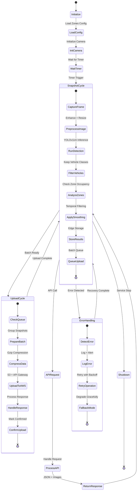
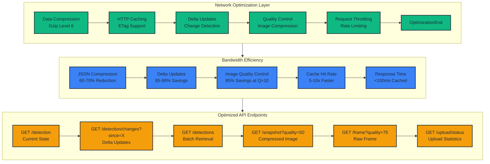
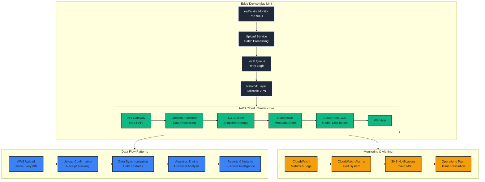
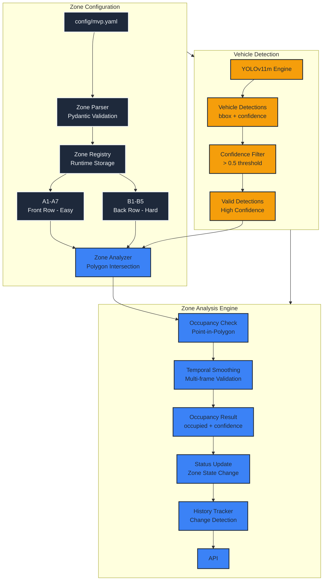
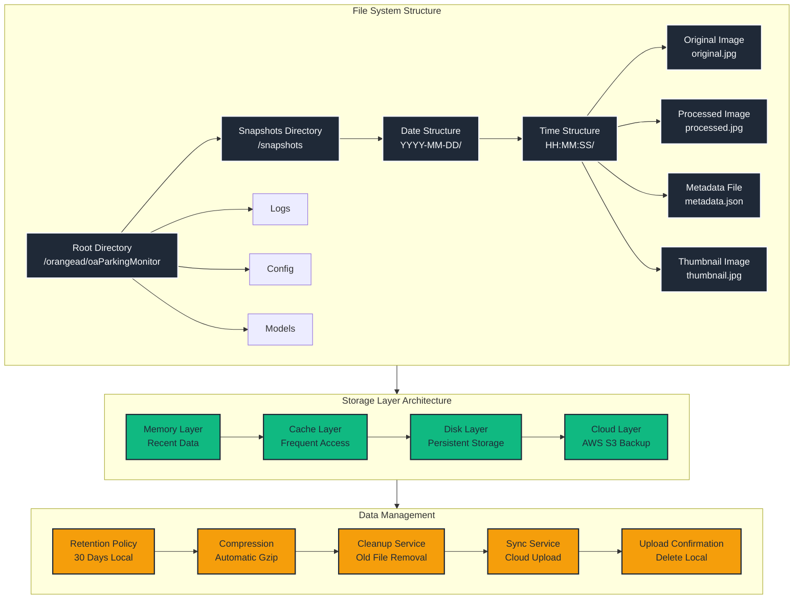
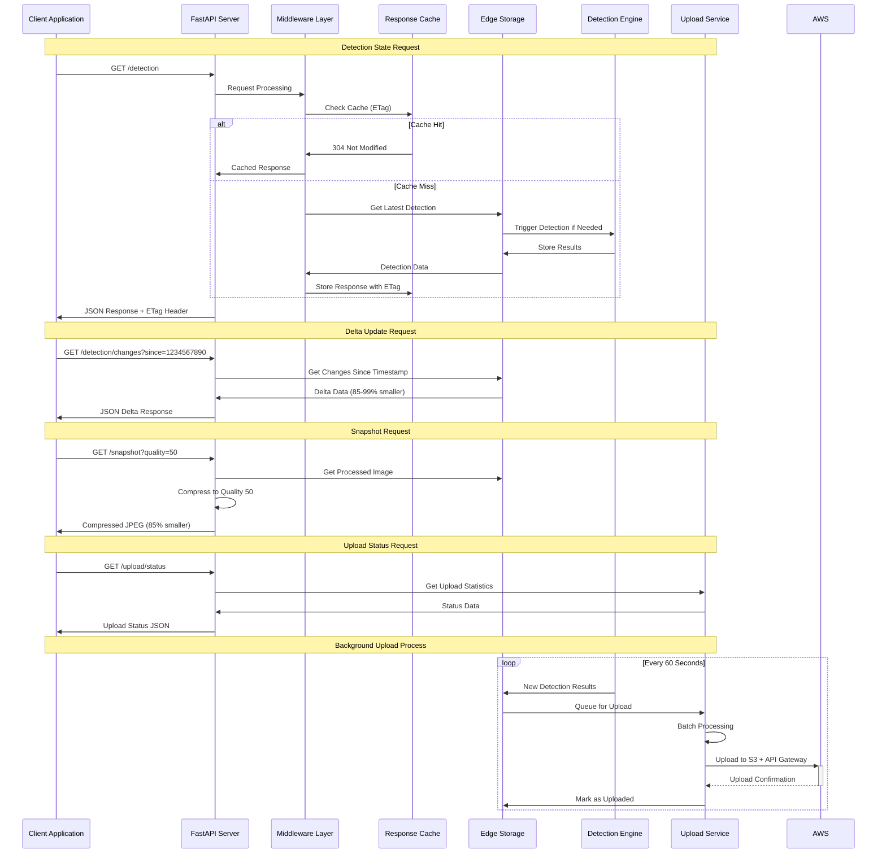
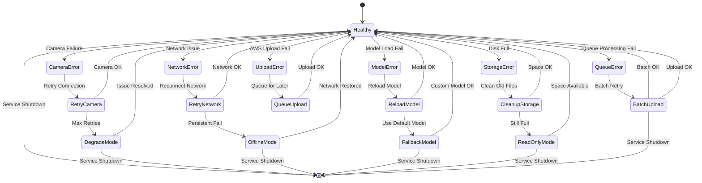
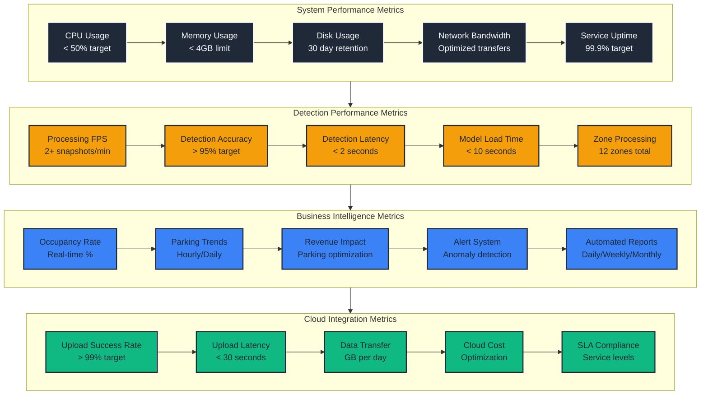

# oaParkingMonitor Workflow Diagram

## Overview

Edge-deployed parking space detection and monitoring service using YOLOv11m models optimized for vehicle detection with network optimization patterns and AWS cloud integration.

## ETL Workflow Architecture

```mermaid
%%{init: {
  'theme': 'base',
  'themeVariables': {
    'primaryColor': '#1f2937',
    'primaryTextColor': '#f8fafc',
    'primaryBorderColor': '#374151',
    'lineColor': '#6b7280',
    'sectionBkgColor': '#1e293b',
    'altSectionBkgColor': '#18181b',
    'gridColor': '#374151',
    'secondaryColor': '#3b82f6',
    'tertiaryColor': '#10b981',
    'background': '#111827',
    'textColor': '#f1f5f9',
    'edgeLabelBackground': '#374151',
    'clusterBkg': '#374151',
    'clusterBorder': '#6b7280',
    'titleColor': '#f8fafc'
  }
}}%%
flowchart TD
    %% Data Sources
    Camera[Camera Hardware\nBuilt-in Mac Mini Camera] --> FrameCapture
    FrameCapture[Frame Capture\nSnapshot Every 5s] --> Preprocessor

    %% Extraction Layer
    Preprocessor[Image Preprocessing\nResize + Enhancement] --> YOLOEngine
    YOLOEngine[YOLOv11m Detection\nMulti-scale Vehicle Detection] --> VehicleFilter

    %% Transformation Layer
    VehicleFilter[Vehicle Class Filter\nCars, Trucks, Buses] --> ZoneAnalyzer
    ZoneAnalyzer[Parking Zone Analysis\nPolygon Intersection] --> OccupancyEngine
    OccupancyEngine[Occupancy Engine\nTemporal Smoothing] --> ResultProcessor

    %% Loading Layer
    ResultProcessor[Result Processing\nJSON Serialization] --> EdgeStorage
    EdgeStorage[Edge Storage\nHierarchical Snapshots] --> UploadQueue
    UploadQueue[Upload Queue\nBatch Processing] --> AWSService

    %% Cloud Integration
    AWSService[AWS Upload Service\nS3 + API Gateway] --> CloudStorage
    CloudStorage[Cloud Storage\nS3 Buckets] --> CloudAPI
    CloudAPI[Cloud API\nData Retrieval] --> Confirmation
    Confirmation[Confirmation Handler\nReceipt Tracking] --> EdgeStorage

    %% API Layer
    EdgeStorage --> LocalAPI
    LocalAPI[Local FastAPI\nPort 9091] --> Clients

    %% Styling
    classDef source fill:#1f2937,stroke:#f8fafc,stroke-width:2px,color:#f8fafc
    classDef processing fill:#1e293b,stroke:#f1f5f9,stroke-width:2px,color:#f1f5f9
    classDef ml fill:#f59e0b,stroke:#1f2937,stroke-width:2px,color:#1f2937
    classDef tracking fill:#3b82f6,stroke:#1f2937,stroke-width:2px,color:#1f2937
    classDef api fill:#10b981,stroke:#1f2937,stroke-width:2px,color:#f8fafc
    classDef storage fill:#8b5cf6,stroke:#1f2937,stroke-width:2px,color:#f8fafc
    classDef network fill:#f59e0b,stroke:#1f2937,stroke-width:2px,color:#1f2937
    classDef error fill:#ef4444,stroke:#1f2937,stroke-width:2px,color:#f8fafc

    class Camera,FrameCapture source
    class Preprocessor,YOLOEngine,VehicleFilter processing
    class ZoneAnalyzer,OccupancyEngine,ResultProcessor tracking
    class EdgeStorage,UploadQueue,AWSService,CloudStorage,CloudAPI,Confirmation storage
    class LocalAPI,Clients api
```

## Snapshot Processing Pipeline

## Network Optimization Patterns

## AWS Integration Architecture

## Zone Analysis Workflow

## Edge Storage Architecture

## API Request Flow

## Performance Optimization Flow

```mermaid
flowchart TD
    subgraph InputOptimization [Input Optimization]
        Interval[Snapshot Interval\n5 seconds] --> Resolution
        Resolution[Resolution Control\n1280x720 Optimal] --> Preprocessing
        Preprocessing[Smart Preprocessing\nROI Detection] --> ModelOpt
    end

    subgraph ModelOptimization [Model Optimization]
        ModelOpt[YOLOv11m CoreML\nM1/M2 Accelerated] --> MultiScale
        MultiScale[Multi-scale Detection\nAccuracy vs Speed] --> Confidence
        Confidence[Confidence Threshold\nQuality Filter] --> BatchSize
        BatchSize[Batch Processing\nEfficient Inference] --> Memory
    end

    subgraph ResourceManagement [Resource Management]
        Memory[Memory Management\n<4GB Footprint] --> CPU
        CPU[CPU Optimization\n<50% Usage] --> Threading
        Threading[Async Threading\nNon-blocking IO] --> Queue
        Queue[Queue Management\nBackpressure Control] --> Throughput
    end

    subgraph NetworkOptimization [Network Optimization]
        Throughput[Throughput Control\nBandwidth Limit] --> Compression
        Compression[Smart Compression\nAdaptive Quality] --> Caching
        Caching[Intelligent Caching\nPredictive Prefetch] --> Latency
        Latency[Latency Reduction\n<100ms Response] --> UX
    end

    InputOptimization --> ModelOptimization
    ModelOptimization --> ResourceManagement
    ResourceManagement --> NetworkOptimization

    classDef input fill:#10b981,stroke:#1f2937,stroke-width:2px,color:#1f2937
    classDef model fill:#3b82f6,stroke:#1f2937,stroke-width:2px,color:#1f2937
    classDef resource fill:#f59e0b,stroke:#1f2937,stroke-width:2px,color:#1f2937
    classDef network fill:#1e293b,stroke:#f1f5f9,stroke-width:2px,color:#f1f5f9

    class Interval,Resolution,Preprocessing,ModelOpt input
    class MultiScale,Confidence,BatchSize,Memory model
    class CPU,Threading,Queue,Throughput resource
    class Compression,Caching,Latency,UX network
```

## Error Handling and Recovery

## Monitoring and Metrics

